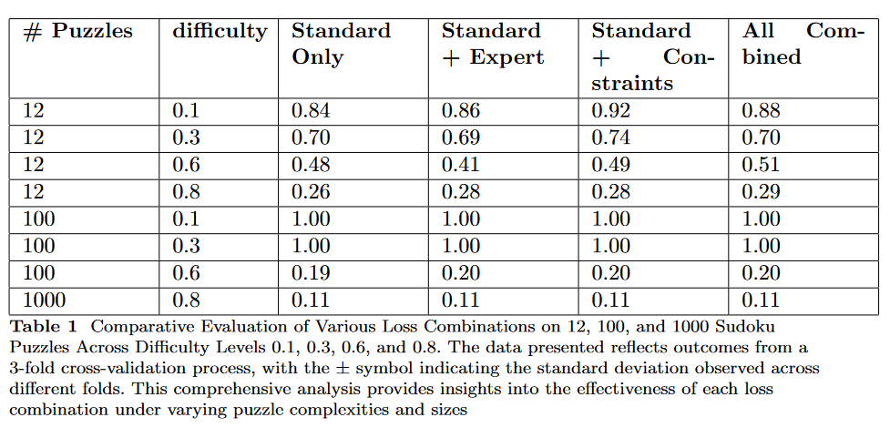

# Bridging Logic and Learning: A Neural-Symbolic Approach for Enhanced Reasoning in Neural Models (ASPER)

## Overview
This repository hosts the research work titled "Bridging Logic and Learning: A Neural-Symbolic Approach for Enhanced Reasoning in Neural Models (ASPER)." Under the acronym ASPEr (Answer Set Programming  Enhanced Reasoning),  it integrates Answer Set Programming (ASP) with a neural model for enhanced logical reasoning and problem-solving capabilities.

## Contributions
Our research contributes to the field in several key areas:
- **Innovative Integration**: Development of a unique integration of ASP solvers with deep learning models, enhancing reasoning in tasks requiring logical consistency.
- **Customized Loss Function**: Introduction of a specialized loss function that combines standard loss with ASP solver outputs for improved learning efficiency.
- **Practical Applicability**: Demonstration of practical applicability and effectiveness through a detailed case study on solving Sudoku puzzles.
- **Model Interpretability**: Emphasis on model interpretability and adaptability across various problem domains.

## Sudoku Puzzle Case Study
The methodology is applied to solve Sudoku puzzles, demonstrating significant improvements in model accuracy and reasoning capabilities.

### Evaluation Results
The following figure illustrates our model's performance across different loss combinations in solving Sudoku puzzles:



### Data Representation
The table below provides a detailed representation of the Sudoku puzzles, highlighting the model's accuracy:


## Repository Structure
- `model/`: Contains the deep learning model files and ASP integration scripts.
- `data/`: Sample datasets used for the Sudoku case study.
- `results/`: Results and analysis reports, including the images `plot.png` and `table.png`.
- `README.md`: This file, providing an overview and guide to the repository.

## Usage
- Download the ASPEN.ipynb notebook from the repository.
- Open the notebook in Google Colab for optimal performance.
- Execute the cells in ASPEN.ipynb in sequential order.
**Note:** Running the cells sequentially is crucial for the correct execution of the notebook. Google Colab is recommended due to its pre-configured environment and easy access to necessary libraries."


## Citation
If you find our research useful, please consider citing our paper:

```bibtex
@misc{machot2023bridging,
  title={Bridging Logic and Learning: A Neural-Symbolic Approach for Enhanced Reasoning in Neural Models (ASPER)},
  author={Fadi Al Machot},
  year={2023},
  eprint={2312.11651},
  archivePrefix={arXiv},
  primaryClass={cs.AI}
}
