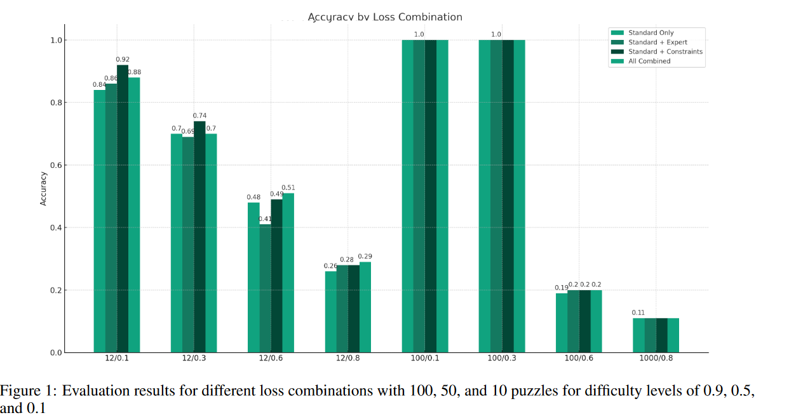

# RIDGING LOGIC AND LEARNING: A NEURAL-SYMBOLIC APPROACH FOR ENHANCED REASONING IN NEURAL MODELS (ASPEN)

## Overview
This repository hosts the research work titled "Bridging Logic and Learning: A Neuro-Symbolic Framework for Enhanced Reasoning in Deep Learning Models." Under the acronym ASPEN (Answer Set Programming Enhanced Neuro-symbolic Network), our study introduces a novel approach in neural-symbolic learning, focusing on integrating Answer Set Programming (ASP) with deep learning models for enhanced logical reasoning and problem-solving capabilities.

## Contributions
Our research contributes to the field in several key areas:
- **Innovative Integration**: Development of a unique integration of ASP solvers with deep learning models, enhancing reasoning in tasks requiring logical consistency.
- **Customized Loss Function**: Introduction of a specialized loss function that combines standard loss with ASP solver outputs for improved learning efficiency.
- **Practical Applicability**: Demonstration of practical applicability and effectiveness through a detailed case study on solving Sudoku puzzles.
- **Model Interpretability**: Emphasis on model interpretability and adaptability across various problem domains.

## Sudoku Puzzle Case Study
The methodology is applied to solve Sudoku puzzles, demonstrating significant improvements in model accuracy and reasoning capabilities.

### Evaluation Results
The following figure illustrates our model's performance across different loss combinations in solving Sudoku puzzles:

### Data Representation
The table below provides a detailed representation of the Sudoku puzzles, highlighting the model's accuracy:

## Repository Structure
- `model/`: Contains the deep learning model files and ASP integration scripts.
- `data/`: Sample datasets used for the Sudoku case study.
- `results/`: Results and analysis reports, including the images `plot.png` and `table.png`.
- `README.md`: This file, providing an overview and guide to the repository.

## Usage
Instructions for replicating our study or applying the ASPEN framework to other problem domains can be found in the `model/` directory.

## Citation
If you find our research useful, please consider citing our paper:
